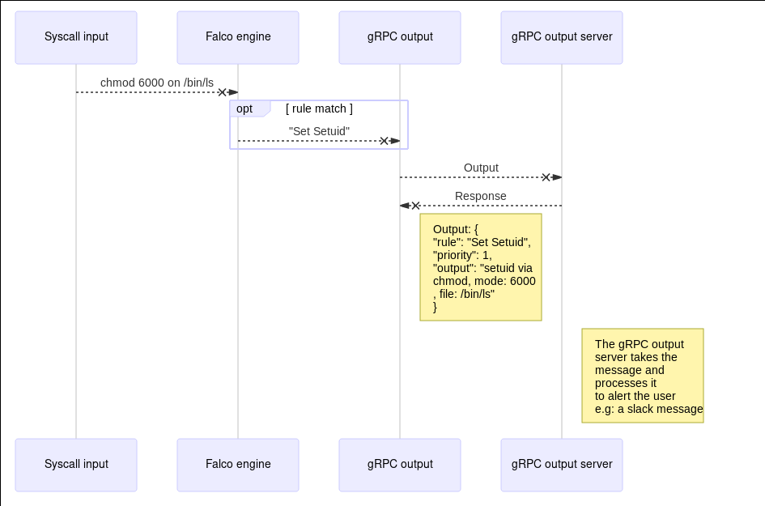

# gRPC Falco Output

<!-- toc -->

- [Summary](#summary)
- [Motivation](#motivation)
  * [Goals](#goals)
  * [Non-Goals](#non-goals)
- [Proposal](#proposal)
  * [Use cases](#use-cases)
  * [Diagrams](#diagrams)
  * [Design Details](#design-details)

<!-- tocstop -->

## Summary

We intend to build a simple gRPC contract and SDKs - eg., [falco#785](https://github.com/falcosecurity/falco/issues/785) - to allow users receive and consume the alerts regarding the violated rules.

## Motivation

The most valuable information that Falco can give to its users are the alerts.
An alert is given by Falco each time a rule is matched.
At the current moment, however, Falco can deliver alerts in a very basic way, for example by dumping
them to standard output.

For this reason, many Falco users asked, with issues - eg., [falco#528](https://github.com/falcosecurity/falco/issues/528) - or in the [slack channel]() if we can find a more consumable way to
implement Falco outputs in an extensible way.

The motivation behind this proposal is to design a new output implementation that can meet our user's needs.

### Goals

- To decouple the outputs from the Falco code base
- To design and implement an additional output containing a gRPC client
- To keep it as simple as possible
- To have a simple contract interface
- To only have the responsibility to route Falco output requests and responses
- To continue supporting the old output formats by implementing their same interface
- To be secure by default
- To be asynchronous and non-blocking


### Non-Goals

- To substitute existing outputs (stdout, syslog, etc.)
- To support connecting to multiple gRPC servers
  - Users can have a single server multiplexing requests to multiple servers
- To support queuing mechanisms for message retransmission
  - Users can have a local gRPC relay server along with Falco that multiplexes connections and handles retires and backoff
- To change the output format
- To make the message context (text, fields, etc.) and format configurable
  - Users can already override rules changing their output messages
- To act as an orchestrator for Falco instances


## Proposal

### Use cases

- Receive Falco events with a well-defined contract over wire
- Integrate Falco events with existing alerting/paging mechanisms
- Integrate Falco events with existing monitoring infrastructures/tools

### Diagrams

The following sequence diagram illustrates the flow happening for a single rule being matched and the consequent alert through the gRPC output client.



### Design Details

- When an `Emit` results in an error the response contains and error code and message
  - Errored emits MUST be handled by Falco by sending the same event in the standard output enriched with the info about the failed `Emit` RPC
- The RPC communication is asynchronous and non-blocking
- The RPC communication is made of two (`Output` and `Response`) bi-directional streams
- `Output` and `Response` messages are correlated through the `id` field
  - The `id` field is crafted by the gRPC output client
- The communication is secured using TLS and the builtin client authentication mechanism

Here is the proto3 contracts definitions for the client and the server SDK.

```proto3
// Overview

// The `FalcoOutputService` service defines the Emit RPC call
// that is used to do a bidirectional stream of events between the output server and Falco.

// The `Output` message is the logical representation of the output model,
// it contains all the elements that Falco emits in an output along with the
// definitions for priorities and sources. It is given as an input to the Emit RPC call.

// The `Response` message is the logical representation of the response to an Emit
// RPC call, it contains a message and the information on wether the server returned an error
// while handling the provided `Output`.

// The `Output` and `Response` messages are enriched with an unique identifier that is needed
// because of the asynchronous nature of the streams in order to correlate them.

service FalcoOutputService {
  rpc Emit (stream Output) returns (stream Response);
}

message Output {
  string id = 1;
  Timestamp time = 2;
  enum Priority {
    EMERGENCY = 0;
    ALERT = 1;
    CRITICAL = 2;
    ERROR = 3;
    WARNING = 4;
    NOTICE = 5;
    INFORMATIONAL = 6;
    DEBUG = 7;
  }
  Priority priority = 3;
  enum Source {
    SYSCALL = 0;
    K8S_AUDIT = 1;
  }
  Source source = 4;
  string rule = 5;
  string format = 6;
  string output = 7;
  map<string, string> output_fields = 8;
}

message Response {
  string id = 1;
  int32 code = 2;
  string message = 3;
}
```

---
